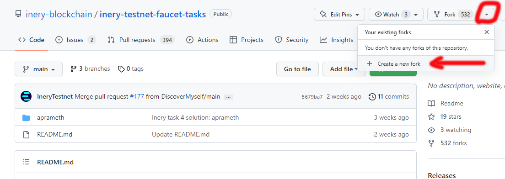
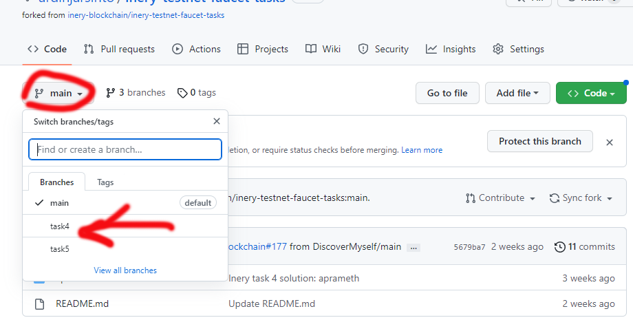
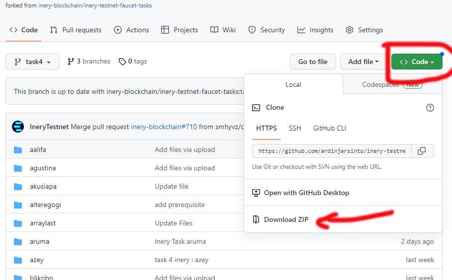
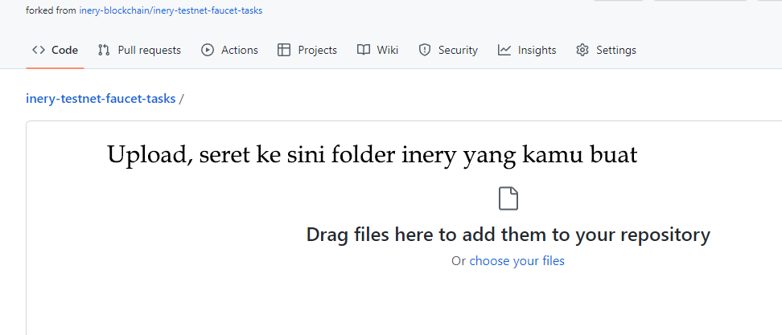
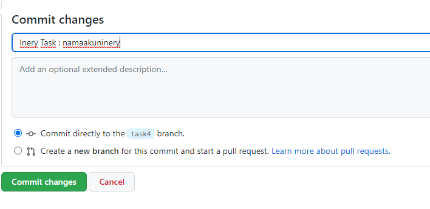
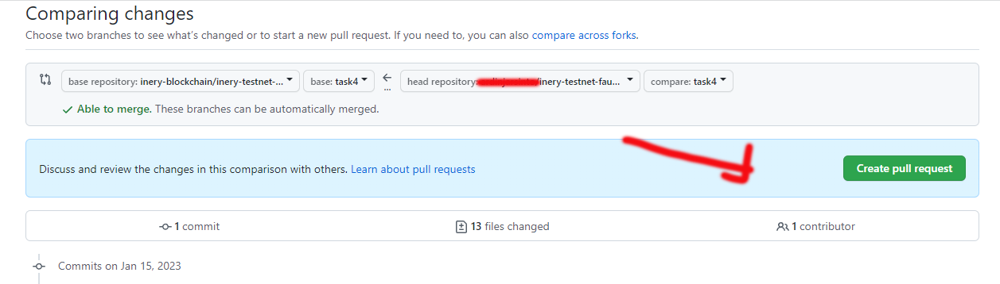

### Fork dari halaman inery
- Silahkan kunjungi https://github.com/inery-blockchain/inery-testnet-faucet-tasks

____________________
### Creat Fork dari halaman inery
- Jangan lupa buang centangnya

____________________
### Rubah main ke task4
- Pastikan ikutan node belajar bertahap dan mengingat-ingat. Jangan manja kebanyakan nanya, abis dijawab kabur tanpa permisi. Kita bukan orang pinta, tapi orang yang mau belajar.

____________________
### Download bahan-bahan
- Tujuan mendownload bahan adalah untuk memainkan peran imajinasi dan kreatifitas kita bermain oplosan file

### Sedikit gambaran cara kerjanya
Nah hal apa yang harus kamu lakukan setelah download, semua bergantung padamu. untuk cluenya adalah
- membuat nama folder sendiri atas nama akun inerymu
-.ngoplos file punya orang, (jangan bilang-bilang kalau ada yang nanya)
- modivikasi nama file dan sedikit isi file. misal create jadi inerycreate atau solutioncreate dll
- setelah kelar upload ke githubmu
- semoga berhasil

____________________
### Upload Folder Manual
- Setelah Folder inery kita jadi, dibuat dengan nama akun inery, dan berisi file-file hasil oplosan hasil kreatifitas kita wkwkwk. maka silahkan upload, harap di pahami, pastikan posisi upload adalah task4

____________________
- Seret foldermu ke github (seret aja gan, kagak usah bingung-bingung), ya seret seret kagak ngerti seret? ngopi dulu sana..

____________________
- Sekrul ke bawah gan.. isi tulisan bagian commit changes biar agak kerenan dikit, abis itu klik  commit changes

____________________
### Commit Task4 ke Inery
- Klik commit ahead

____________________
- klik Create pull request

____________________
- Dan lanjutkan

____________________
### SEMOGA DI ACC, kalau tidak diacc atau ditandai duplikat, silahkan coba lagi dan mainkan imajinasimu..

